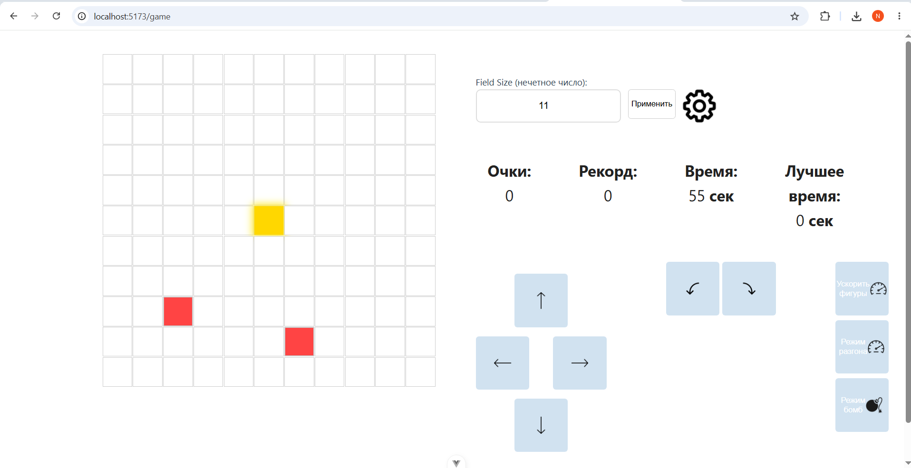
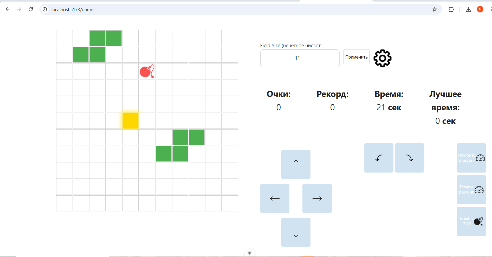
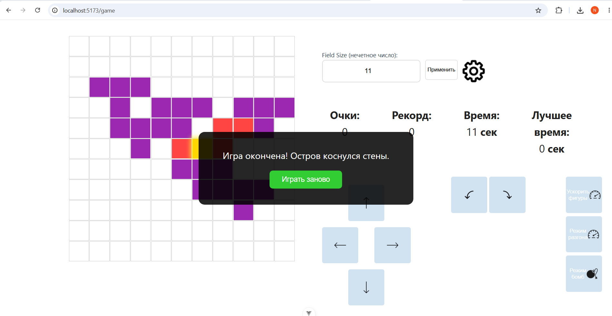
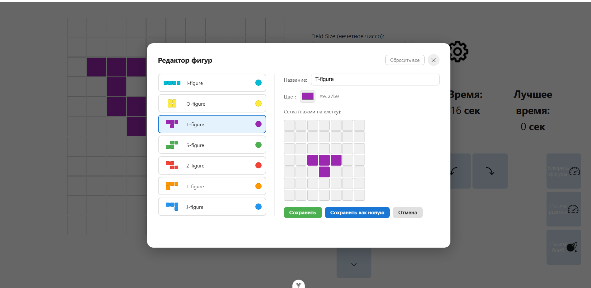

# Island Survival — Vue 3 + Vuex Game

A browser puzzle/survival game built with **Vue 3**, **TypeScript**, and **Vuex**, containerized with **Docker Compose**. Grow your island by catching falling Tetris-style figures, clear layers for points and bonus time, dodge (or exploit) bombs, and survive as long as possible before the walls close in.

## Gameplay

The game takes place on an **N × N** grid (N is always odd, so the board always has a true center cell).

- The game starts with a single cell — the **core** — placed exactly in the center of the field. This core is your controllable **island**.
- **Tetris-shaped figures** (I, O, T, S, Z, L, J) spawn from a random side of the field and fly straight across toward the opposite side.
  - A figure never spawns from the same side it spawned from on the previous flight.
  - When a figure collides with the island, it **attaches** to it, growing the island's shape.
- **Layers**: cells are grouped into concentric square "rings" (layers) around the core, based on Chebyshev distance. Whenever a layer is **completely filled**, it clears:
  - Every cell in the cleared layer gives **+5 points**.
  - Every cell further out than the cleared layer "falls off" and gives **+1 point** each.
  - The island resets down to just its core.
  - The timer gets a **+60 second bonus**.
- **Game over** condition: if any island cell touches any wall of the field, the game ends immediately.
- **Timer**: the game runs on a 60-second countdown by default. Time runs out → game over. Layer clears refill the clock (see above).
- **Scoring penalty**: any figure that flies past the island and off the field docks a small point penalty for the miss.

### Controls

| Action | Input |
|---|---|
| Move island | Arrow buttons / Arrow keys |
| Rotate island 90° clockwise | `E` |
| Rotate island 90° counter-clockwise | `Q` |
| Accelerate the next incoming figure | `Space` / "Ускорить фигуры" button |
| Toggle gradually increasing figure speed | `S` / "Режим разгона" button |
| Toggle bomb mode | `B` / "Режим бомб" button |

The island rotates around its core cell, and all resulting coordinates are clamped to stay within the field bounds.

### Speed & difficulty modes

- **Instant boost** — a one-off speed boost applied to the *next* spawned figure only.
- **Ramp-up mode** — once enabled, global figure speed increases by 1 every 15 seconds until turned off (speed resets to 1 when disabled).

### Bombs

When bomb mode is active, bombs spawn periodically (up to **3 on screen at once**) and fly across the field the same way figures do. There are three types:

| Bomb | Effect on hit |
|---|---|
| ⚫ Black (1×1) | Strips every attached cell off the island (keeps only the core) and applies a point penalty per lost cell |
| 🔴 Red | Subtracts **30 seconds** from the timer |
| 🟢 Green | Bonus — adds **10 seconds** to the timer |

### Figure editor

An in-game editor (gear icon) lets you inspect and customize the falling figures:

- Browse the 7 base Tetris figures (I, O, T, S, Z, L, J).
- Edit a figure's cell layout on a 7×7 grid, rename it, and recolor it via a color picker.
- Save changes to an existing figure, or save any edit as a brand-new custom figure.
- Delete custom figures (base figures are protected from deletion).
- Reset the whole figure library back to the 7 base defaults.

## Goal

Survive as long as possible and rack up the highest score by chaining layer clears while avoiding walls, misses, and hostile bombs. High score and best survival time are saved locally between sessions.

## Tech Stack

- [Vue 3](https://vuejs.org/) (Options API, `<script lang="ts">`)
- [Vuex 4](https://vuex.vuejs.org/) with namespaced modules (`figure`, `figureShapes`)
- TypeScript
- SCSS (scoped component styles)
- Docker & Docker Compose for local development/deployment

## Project Structure

```
src/
├── components/
│   ├── pages/
│   │   └── GamingPage.vue      # Main game page: game loop, controls, timer, HUD
│   ├── ui/
│   │   ├── PlayingField.vue    # Renders the grid, island, figures, and bombs
│   │   └── FigureEditor.vue    # Figure library editor (create/edit/delete shapes)
├── store/
│   ├── index.ts                # Root Vuex store
│   ├── figure.ts                # Figures, bombs, collisions, scoring, timer-affecting logic
│   └── figureShapes.ts          # Base/custom figure shape definitions
```

## Getting Started

### Prerequisites

- [Docker](https://www.docker.com/) and [Docker Compose](https://docs.docker.com/compose/) installed

### Run with Docker Compose

```bash
git clone https://github.com/nastya-kolle/vue-3-docker-compose.git
cd vue-3-docker-compose
docker compose up --build
```

The app will be available at the port configured in `docker-compose.yml` (check the file for the exact mapping, typically `http://localhost:8080` or `http://localhost:3000`).

To stop the containers:

```bash
docker compose down
```

### Run locally without Docker

```bash
cd vue
npm install
npm run dev
```

## Screenshots

**Gameplay** — island growing as it catches falling figures:



**Bomb mode** — bombs (black/red/green) flying across the field alongside a figure:



**Game over** — the island touched the wall:



**Figure editor** — browsing and editing the T-figure shape:



## Video Demos

- **Lab 1:** [Google Drive](https://drive.google.com/file/d/1BtWNQQZol6D8Yd_vDCyetf6tEGHUBYWn/view?usp=sharing)
- **Lab 2:** [Google Drive](https://drive.google.com/file/d/1-RGN5Hs8Nx8KLm4dY58jNzEJZt8JS9EJ/view?usp=sharing)
- **Lab 3:** [Google Drive (part 1)](https://drive.google.com/file/d/16Hgz5x1ItKExQ1TibZZ-QvnTV7RualDW/view?usp=sharing) · [Google Drive (part 2)](https://drive.google.com/file/d/1x0OImoFsL_--NtnNYPsSdmUj-ImCspOz/view?usp=sharing)

## Notes

- Field size is configurable at runtime via the input field (must be an odd number) — the "Применить" button re-centers the island and rebuilds the grid.
- Game state (score, figures, bombs) lives entirely in Vuex; high score and best survival time are persisted to `localStorage`.
